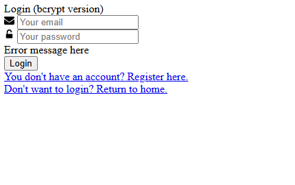
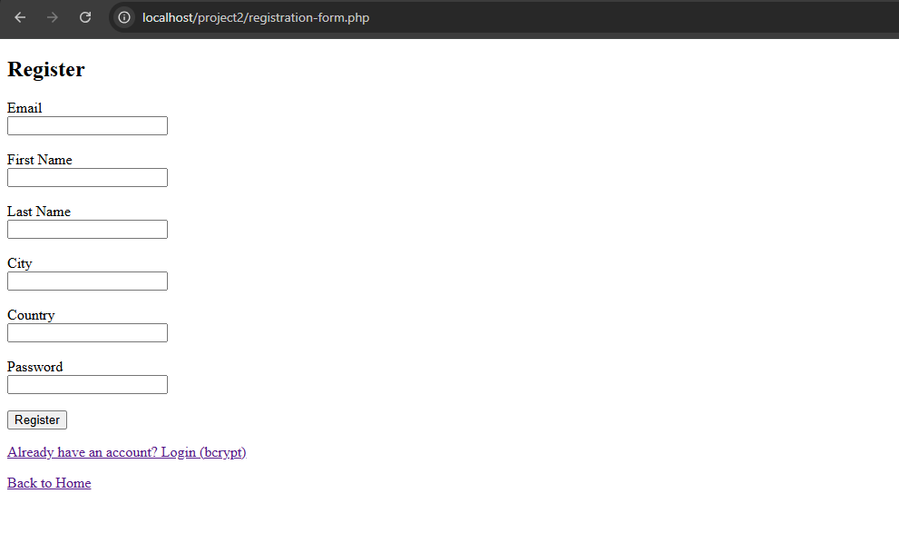

# PHP Secure Login

A secure login and registration system built with PHP for CIS 355. This project implements two different password hashing methods: **bcrypt** and **SHA256 with salt**, with support for session-based login/logout and SQLite as the backend database.

## 🔐 Security Features

- Bcrypt password hashing with PHP's `password_hash()` and `password_verify()`
- SHA256 hashing with custom salt generation and comparison
- SQLite database backend (no server credentials needed)
- Secure session management and logout flow
- PDO prepared statements to prevent SQL injection

## 📁 Files Included

- `index.php` – Home page with login status
- `login-form-bcrypt.php` – Login using bcrypt
- `login-form-salt.php` – Login using SHA256 + salt
- `registration-form.php` – Register with both hash formats
- `logout.php` – Clears session and returns to home
- `config.inc.php` – PDO connection to SQLite
- `security.db` – Preloaded database file with test user
- `test-db.php` – Simple connection test
- `tailwind.css` – Styling
- `florence.jpg` – Sample image

## 🧪 Test Account

You can log in using the following test account:

- **Email:** abaudic5@yellowpages.com
- **Password:** mypassword

## ▶️ How to Run Locally

1. Download and install [XAMPP](https://www.apachefriends.org/index.html)
2. Place this folder inside `C:/xampp/htdocs/`
3. Start Apache using the XAMPP control panel
4. Visit `http://localhost/PHP-Secure-Login/` in your browser
5. Test login via either method

## 📸 Screenshots

### Login Form

### Registration Form

## 🧠 Skills Demonstrated

- Authentication & password hashing
- Secure database interaction (PDO)
- Form validation & session handling
- Real-world debugging of environment configs

## 📸 Optional

You can add screenshots of the login and registration pages here.
